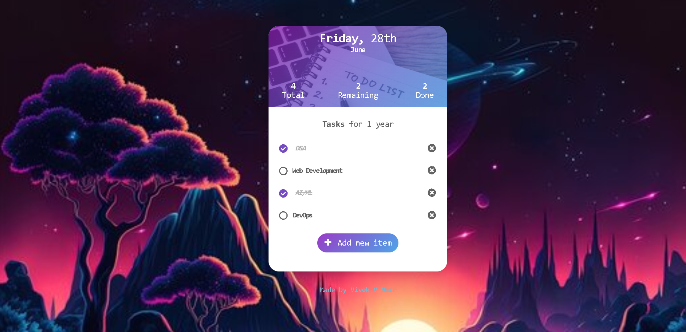

# To--do-list
 
- A To-do list app made with JQuery.

## Features
- Add or remove to-do list items
- edit to-do list items
- check and uncheck to-do list items
- Run online and offline
---
## Run the To-Do-App
### To run the To-Do-App `online` 
- go to [https://to-do-app-jquery.vercel.app](https://to-do-list-sage-omega.vercel.app/)
### To run the To-Do-App `offline` follow the bellow steps
- First go to the releases in this repo and download `to-do-list.app.zip` folder
- Then `Extract` the `to-do-list.app.zip` folder
- And run the `index.html` file in your web browser
---
### Browser Support
 |  |  |  | 
--- | --- | --- | --- | --- |
Latest ✔ | Latest ✔ | Latest ✔ | Latest ✔ | Latest ✔ |
---
